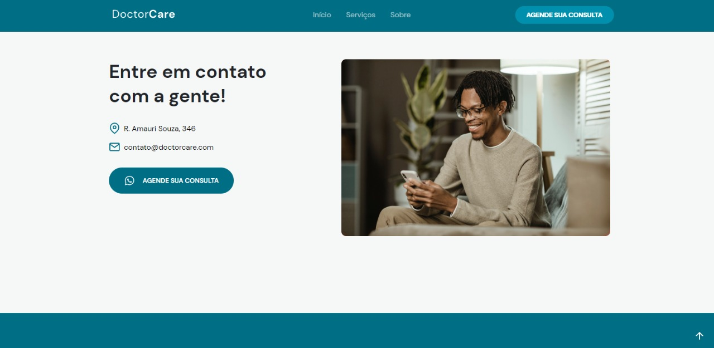
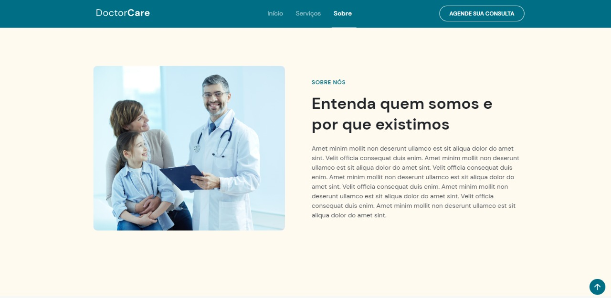

  

<h1 align="center">Landing page hospitalar</h1> 

Trilha da Rocketseat

Tabela de conteúdos
=================
<!--ts-->
   * [Sobre](#Sobre)
   * [Instalação](#Instalação)
   * [Como usar](#como-usar)
      * [Pre Requisitos](#pre-requisitos)
   * [Tecnologias](#tecnologias)
<!--te-->

<h4 align="center"> 
      	✔️  Pronto  ✔️
</h4>

## Sobre

Landing page feito em conjunto com a trilha NLW Return feita pela Rockeatseat no ano de 2022 dos dias 01/05/22 até o dia 08/05/22.

## Imagens

## Instalação

Para instalar basta escrever o codigo abaixo em seu terminal:

    git clone "https://github.com/Taunt-byte/Landing-page-NLW-Return.git"

## Como usar

Para ver o programa rodando basta abrir o arquivo "index.html"

## Pre Requisitos

1- Ter o git instalado
2- Ter uma IDE para utilizar do codigo fonte

## Tecnologias

<table>
    <tr>
    <td>Javascript</td>
    <td>HTML</td>
    <td>CSS</td>
    </tr>
    <tr>
    <td>-</td>
    <td>5</td>
    <td>3</td>
    </tr>
</table>